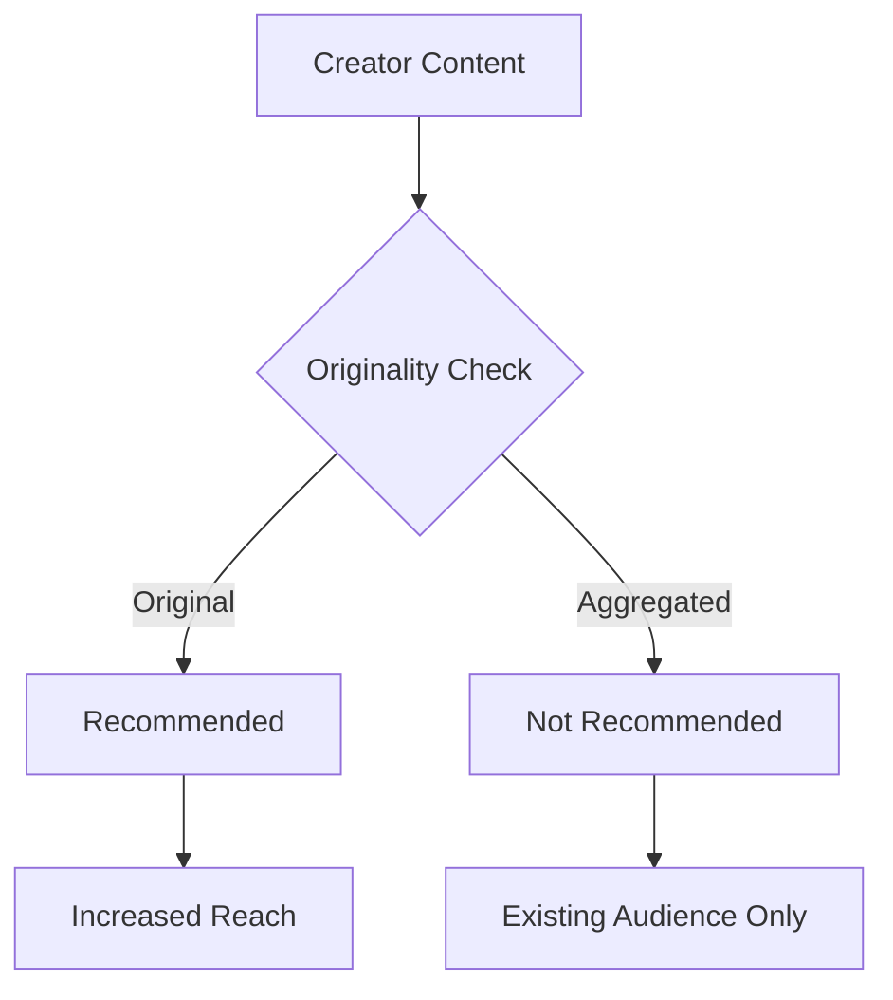

import { Callout, Steps, Step } from "nextra-theme-docs";

# Engaging and Supporting Creators

At Instagram, we understand the importance of fostering a vibrant and thriving creator community. Our platform's success is intrinsically tied to the success of the creators who bring their creativity and unique perspectives to the table. As such, we are committed to engaging and supporting creators, especially those who are just starting out or are still in the emerging stages of their journey.

## Reach and Growth Opportunities

One of the primary concerns for creators is ensuring that their content reaches a broad audience and has the potential for growth. At Instagram, we recognize the significance of providing creators with opportunities to expand their reach and connect with new audiences.

<Callout emoji="💡">
Reach is a means to an end, not an end in itself. While growing your reach is important, it should be a relatively stable process over time. Pure stability is not possible, but we strive to provide creators with more predictable reach growth.
</Callout>

We understand that reach can be volatile, especially for smaller creators. That's why we're continuously working on improving our recommendation systems and surfacing content from emerging creators in our various discovery surfaces, such as Explore and the Reels tab.

<Steps>
### Step 1
Focus on creating high-quality, engaging content that resonates with your target audience.

### Step 2
Leverage Instagram's various engagement signals, such as sends per reach, average view duration, and likes, to improve your content's visibility in the algorithm.

### Step 3
Collaborate with other creators in your niche or complementary niches to cross-promote and tap into new audiences.

### Step 4
Consistently analyze your insights and adapt your content strategy based on what performs well and resonates with your audience.
</Steps>

By following these steps and leveraging Instagram's features and recommendation systems, creators can increase their chances of reaching new audiences and fostering sustainable growth.

## Originality and Content Aggregation

At Instagram, we value originality and aim to ensure that the creators who put in the effort to create original content are rewarded for their efforts. To this end, we have implemented measures to prioritize original content over aggregated or unoriginal content in our recommendation systems.

<Callout emoji="⚠️">
While we aim to promote original content, we understand that not all aggregated content is problematic. We try to strike a balance by allowing content from accounts you follow to be visible, while limiting the recommendation of aggregated content from accounts you don't follow.
</Callout>

Our goal is to create an environment where creators feel empowered to share their authentic voices and original perspectives, without being overshadowed by accounts that primarily aggregate content from others.

## Building a Creator Community

Beyond reach and originality, we recognize the importance of fostering a strong sense of community among creators on Instagram. We believe that creators thrive when they can connect with one another, share experiences, and collaborate on projects.

To facilitate these connections, we have implemented various features and initiatives, such as:

- **Creator-to-creator messaging**: Allowing creators to directly message and interact with one another, facilitating collaborations and networking opportunities.
- **Creator events and workshops**: Hosting virtual and in-person events where creators can learn from industry experts, share best practices, and connect with like-minded individuals.
- **Creator partnerships**: Facilitating partnerships between creators and brands, providing monetization opportunities and exposure to new audiences.

<Callout emoji="🤝">
We understand that being a creator is not just a hobby but a profession. By fostering a strong creator community, we aim to provide creators with the support, resources, and connections they need to turn their passion into a sustainable career.
</Callout>

Additionally, we actively seek feedback from creators and work closely with them to understand their needs and pain points. By listening to their voices and incorporating their insights, we can continuously improve our platform and better serve the creator community.