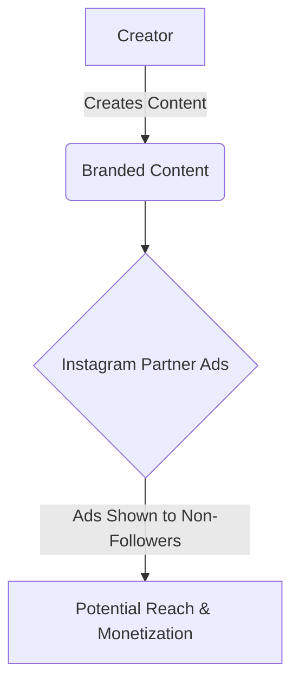

import { Callout, Steps, Step } from "nextra-theme-docs";

# Creator Monetization and Revenue Sharing

Instagram's approach to creator monetization and revenue sharing has been a topic of ongoing interest and discussion within the creator community. While the platform has made strides in supporting creators' ability to monetize their content, there are still challenges and considerations to address.

## Instagram's Monetization Strategies

Instagram's primary monetization strategies for creators revolve around native advertising and branded content partnerships. Unlike platforms like YouTube, which have established revenue-sharing models, Instagram's approach is more focused on facilitating direct partnerships between creators and brands.

### Branded Content Partnerships

One of the primary ways creators can monetize on Instagram is through branded content partnerships. This involves collaborating with brands to create sponsored content, often in the form of posts or Reels. Creators can negotiate rates and terms directly with brands, allowing for greater flexibility and potential earnings.

<Callout>
💡 "In and then Distributing that content on Instagram so and I do I do totally understand the revenue matters a ton particularly for large creators and large creators are disproportionately important right because they reach more people." - Adam Mosseri
</Callout>

According to Adam Mosseri, the head of Instagram, the branded content industry on the platform is estimated to be worth well over $5 billion. This highlights the significant potential for creators to generate revenue through these partnerships.

### Native Advertising with Partner Ads

Another avenue for monetization on Instagram is through the platform's Partner Ads program. This feature allows creators to collaborate with brands by creating content that can be used as ads targeting users who don't follow the creator's account.

The key advantage of Partner Ads is that it provides measurement and attribution capabilities, allowing brands to better understand the performance and impact of the sponsored content. This data can help inform future partnerships and negotiations between creators and brands.

<Callout>
⚠️ "If we could do that and if you could do not just Age collection but also parental control at the operating system or the App Store level you would have way less mistakes" - Adam Mosseri, on the challenges of age verification and parental controls across platforms.
</Callout>

## Revenue Sharing Programs: Challenges and Considerations

While Instagram has explored revenue-sharing programs, particularly for short-form video content like Reels, there are several challenges and considerations to address.

### Attribution and Measurement

One of the primary challenges with revenue sharing for short-form video content is the attribution of ad revenue. With users consuming multiple short videos in quick succession, determining which specific creator should receive a share of the ad revenue becomes more complex.

Adam Mosseri acknowledged this challenge, stating, "If you watch 50 videos and you see 15 ads, who gets those dollars? Attribution is tricky in and of itself."

### Program Sustainability and Credibility

Another consideration is ensuring that any revenue-sharing program is sustainable and provides credible payouts to creators. Mosseri emphasized the importance of ensuring that the program generates enough revenue to support meaningful payouts, rather than sending creators insignificant checks that could negatively impact their perception of the platform.

<Steps>

### Step 1: Identify Monetization Opportunities

Evaluate your content strategy and audience to determine the most suitable monetization opportunities. Consider branded content partnerships, sponsored posts, or exploring Instagram's Partner Ads program.

### Step 2: Build Relationships with Brands

Engage with brands that align with your niche and values. Establish connections and pitch collaboration ideas that can provide value to both parties.

### Step 3: Negotiate Fair Rates

Research industry standards and benchmark your rates based on your audience size, engagement, and the scope of the partnership. Negotiate fair compensation that reflects the value you bring to the brand.

### Step 4: Deliver High-Quality Content

Ensure that the sponsored content you create is authentic, engaging, and aligns with your brand and the partnering brand's values. High-quality content is essential for maintaining trust with your audience.

### Step 5: Explore Revenue Sharing Programs

Stay updated on Instagram's revenue-sharing programs for short-form video content like Reels. While challenges exist, these programs may provide additional monetization opportunities as they evolve.

</Steps>

Instagram's approach to creator monetization and revenue sharing is constantly evolving. While there are challenges to overcome, particularly around attribution and sustainability, the platform's focus on facilitating brand partnerships and native advertising presents significant opportunities for creators to monetize their content and grow their businesses.